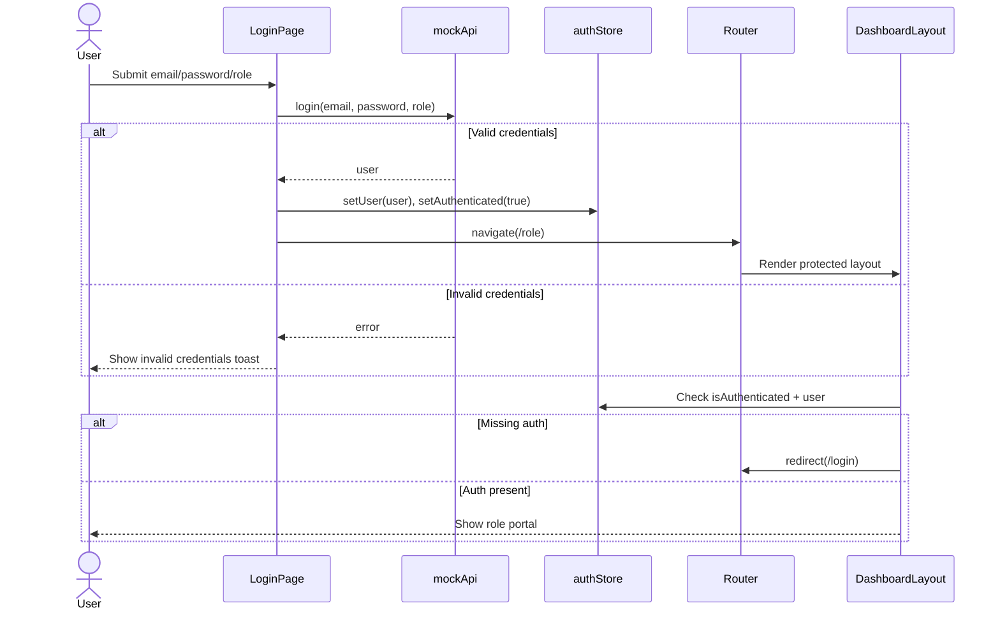
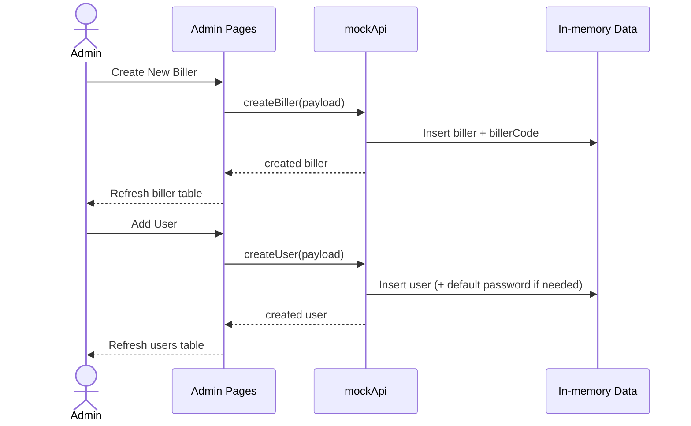
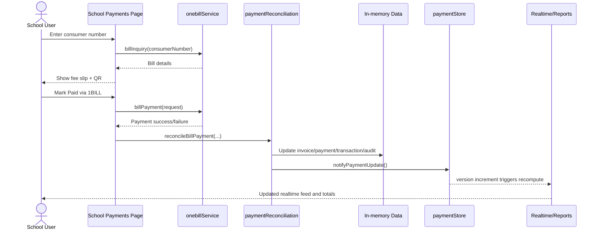
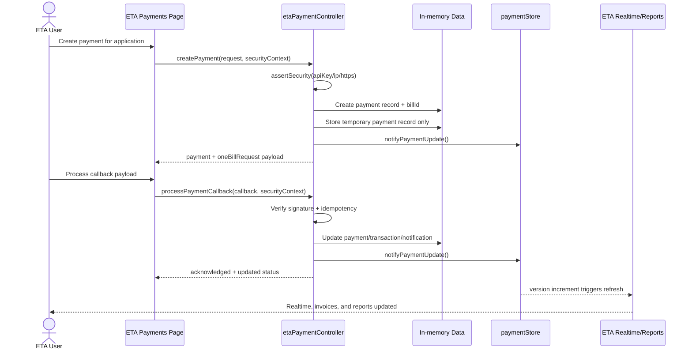
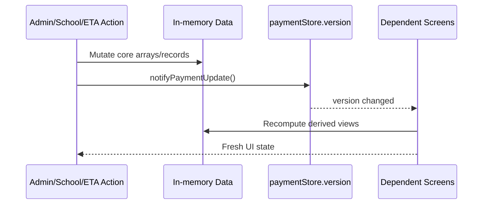
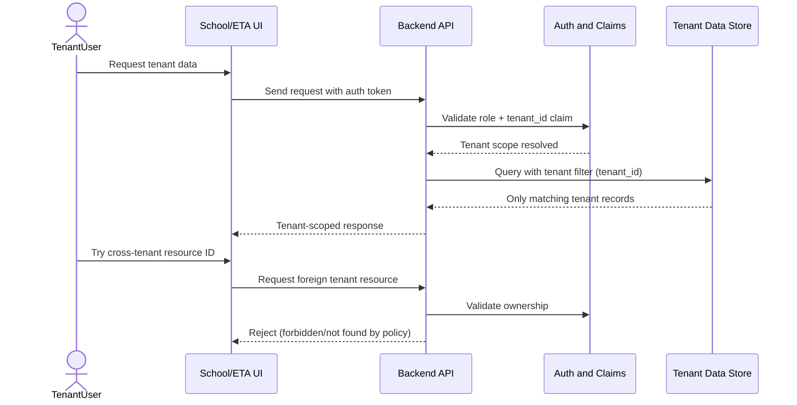

# Billing Brilliance Workflow (Sequence View)

Last updated: 2026-04-05

Related workflow docs:

- Full Workflow: [workflow.md](./workflow.md)
- ETA Dashboard Workflow: [eta-dashboard-workflow.md](./eta-dashboard-workflow.md)

This is a compact visual companion to the full workflow in [workflow.md](./workflow.md).

ETA ownership boundary for this flow:

- ETA/ETEA source system owns student/applicant master data.
- This system acts as payment processor only.
- Store temporary payment records per application/payment request.
- Do not model permanent student ownership in the payment engine.

## 1. Login and Route Guard

## 2. Admin Setup Flow (Biller and Users)

## 3. School Payment Collection Flow

## 4. ETA Application Payment Flow

## 5. Shared State Refresh Pattern

## 6. SaaS Tenant Isolation Flow

## 7. Runtime Note

- This repository currently runs frontend-first with in-memory state.
- Most mutations are session-scoped unless explicitly stored (for example ETA security context in localStorage).
- OneBill defaults to mock mode unless environment flags switch it to live.
- ETA mock reference rows are demo fixtures; production ownership remains in source system.